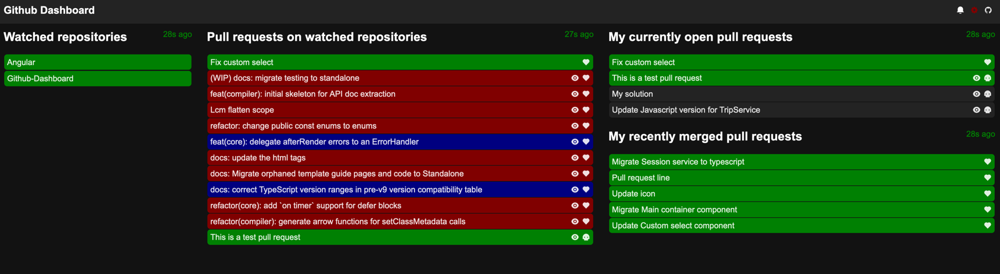

# Github dashboard

TEST

Follow multiple repositories and get notifications when someone opens a new pull requests.
Get in one view, build statuses for the repositories and associated pull requests.

Really helpful when working with multiple repositories in microservice architecture for example.

Here is an example of the dashboard in action :


Notes:
* Data consumes only github api (works with private instances of github enterprise)
* Everything is stored locally in your browser

## Contributing

## Install dependencies

The first time, you checkout the project, you will need to use npm to install dependencies

```bash
# nvm install // install node version
# nvm use // use right node version
# npm ci // install dependencies for the project
```

## Running tests

To run tests, you need to
```bash
# npm test
```

## Generate coverage report

```bash
# npm test -- --coverage
```
It will generate a coverage report in `/coverage` repository

## Running the project locally

To run the project, you need to
```bash
# npm start
```

## Building the project

The project can be built with the following command
```bash
# npm run build
```

It will generate the bundle in `/dist` repository.

## Deploying

When commits lands on master branch after the pull request validation, github-action
will automatically launch a build that will deploy to github-pages when completed.

## Generating component

To generate component, [plop](https://github.com/amwmedia/plop) has been added :
```bash
# npm run plop
```

It will ask for the component name, and will generate a folder with base files to work with.
--

*Every given path is from project directory
